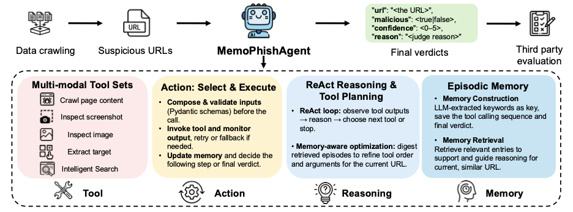

# MemoPhishAgent

This repository is the implementation of the ACL 2026 Industry Track paper **“MemoPhishAgent: Memory-Augmented Multi-Modal LLM Agent for Phishing URL Detection.”**

MemoPhishAgent is a multi-modal phishing URL detection framework that combines tool-using LLM agents, phishing-specific tool design, and an episodic memory module. 

<p align="center">
  <a href="assets/overview.pdf">System overview (PDF)</a>
</p>

<p align="center">
  
</p>

## Overview

MemoPhishAgent supports:

- A full multi-modal ReAct-style agent with memory augmentation
- A no-image agent baseline
- A deterministic workflow baseline
- A monolithic prompt-only baseline

At a high level, the agent combines:

- `crawl_content` for page text and screenshots
- `extract_targets` for selecting follow-up links and images
- `check_screenshot` and `check_image` for visual evidence
- `serpapi_search` for auxiliary search evidence
- An episodic memory module that retrieves and reuses similar prior cases

## Quickstart

Build the Docker image from the repo root:

```bash
docker build -t memophishagent ./agent
```

Create an environment file from the template and add your API credentials:

```bash
cp agent/.env.example agent/.env
```

Run the full agent on the demo subset with OpenAI:

```bash
docker run --rm \
  --env-file agent/.env \
  -v "$(pwd)":/repo \
  -w /repo/agent \
  memophishagent \
  python src/graph.py \
    --agent full_agent \
    --provider openai \
    --input ../test_urls.txt \
    --output output.json
```

Run the same command with Bedrock by switching the provider and making AWS credentials available to the container, for example by mounting `~/.aws`:

```bash
docker run --rm \
  --env-file agent/.env \
  -v "$(pwd)":/repo \
  -v "$HOME/.aws":/root/.aws:ro \
  -w /repo/agent \
  memophishagent \
  python src/graph.py \
    --agent full_agent \
    --provider bedrock \
    --input ../test_urls.txt \
    --output output.json
```

Run the monolithic baseline:

```bash
docker run --rm \
  --env-file agent/.env \
  -v "$(pwd)":/repo \
  -w /repo/agent \
  memophishagent \
  python src/baseline_monolithic.py \
    --provider openai \
    --input ../test_urls.txt \
    --output monolithic_output.txt
```

## Example Scripts

The snippets below show how to run MemoPhishAgent on the demo subset and on the released SocPhish URLs.

Run the full MemoPhishAgent system on the small demo subset:

```bash
#!/usr/bin/env bash
set -euo pipefail

docker run --rm \
  --env-file agent/.env \
  -v "$(pwd)":/repo \
  -w /repo/agent \
  memophishagent \
  python src/graph.py \
    --agent full_agent \
    --provider openai \
    --input ../test_urls.txt \
    --output demo_full_agent.json
```

Run the full MemoPhishAgent system on the released SocPhish URLs:

```bash
#!/usr/bin/env bash
set -euo pipefail

docker run --rm \
  --env-file agent/.env \
  -v "$(pwd)":/repo \
  -w /repo/agent \
  memophishagent \
  python src/graph.py \
    --agent full_agent \
    --provider openai \
    --input ../data/socphish/socphish_public_urls.txt \
    --output socphish_full_agent.json
```

Run the baselines on the same released SocPhish URLs:

```bash
#!/usr/bin/env bash
set -euo pipefail

INPUT_FILE="../data/socphish/socphish_public_urls.txt"

docker run --rm \
  --env-file agent/.env \
  -v "$(pwd)":/repo \
  -w /repo/agent \
  memophishagent \
  python src/graph.py \
    --agent determine \
    --provider openai \
    --input "$INPUT_FILE" \
    --output socphish_determine.json

docker run --rm \
  --env-file agent/.env \
  -v "$(pwd)":/repo \
  -w /repo/agent \
  memophishagent \
  python src/graph.py \
    --agent noimg_agent \
    --provider openai \
    --input "$INPUT_FILE" \
    --output socphish_noimg_agent.json

docker run --rm \
  --env-file agent/.env \
  -v "$(pwd)":/repo \
  -w /repo/agent \
  memophishagent \
  python src/baseline_monolithic.py \
    --provider openai \
    --input "$INPUT_FILE" \
    --output socphish_monolithic.txt
```

Practical notes:

- Start with `test_urls.txt` to verify your credentials and Docker setup before running the full dataset.
- `data/socphish/socphish_public_urls.txt` contains all `753` released URLs and is intended for batch evaluation.
- A full run is substantially slower and more expensive than the demo subset because each URL can trigger multiple crawls, tool calls, and LLM invocations.
- The dataset contains live URLs; some pages may change, disappear, or rate-limit requests over time.

## Main CLI

The main entrypoint is:

```bash
python src/graph.py
```

Supported agent modes:

- `determine`: a deterministic multi-step workflow baseline that uses the same tools in a fixed order without agent planning.
- `noimg_agent`: a ReAct-style agent baseline that uses textual tool reasoning but does not use image-based tools.
- `full_agent`: the main MemoPhishAgent configuration, which combines dynamic tool use, visual evidence, and episodic memory.

Important flags:

- `--agent`: selects which pipeline to run. `full_agent` is the main multi-modal phishing agent system, `noimg_agent` disables image-based reasoning, and `determine` runs the deterministic workflow baseline.
- `--provider`: chooses the LLM backend, either `openai` or `bedrock`.
- `--model`: optionally overrides the default model for the selected provider.
- `--input`: path to a text file containing one URL per line.
- `--output`: path to the JSON file where structured URL-level predictions are written.
- `--use-ai-overview`: enables or disables the SerpAPI Google AI Overview shortcut used before the full agent flow.
- `--use-memory`: enables or disables the episodic memory module during full-agent runs.
- `-k`: sets how many similar past cases the memory module retrieves.
- `--threshold`: sets the similarity threshold for accepting retrieved memories; higher values make memory reuse more conservative.

Outputs:

- `output.json`: structured URL verdicts
- `output_failed_urls.txt`: URLs that failed during processing, when present

Example `output.json` item:

```json
{
  "url": "https://example.com",
  "malicious": false,
  "confidence": 4,
  "reason": "The page appears to be a legitimate site and does not show phishing indicators.",
  "memory_case": "full_reasoning"
}
```

For a concise example of a real output file, see:

- [outputs/sample_predictions.json](/Users/xuanchen/Desktop/26-ACL-Phish/MemoPhishAgent/outputs/sample_predictions.json:1)

## Sample Trajectory

Below is an example trajectory. It shows the tool sequence MemoPhishAgent executes during classification without exposing a noisy full trace.

Input URL:
`https://sites.google.com/view/trail`

Tool sequence:

1. `crawl_content`
   The initial page text was sparse and mostly contained generic Google Sites boilerplate such as `Search this site`, `Embedded Files`, and `Report abuse`.

2. `check_screenshot`
   The screenshot analysis identified an Amazon logo and a login form asking for credentials, which is a strong phishing indicator.

Final verdict:

```json
{
  "url": "https://sites.google.com/view/trail",
  "malicious": true,
  "confidence": 4,
  "reason": "Screenshot analysis shows Amazon logo and login form, indicating an Amazon phishing attempt."
}
```

## SocPhish Dataset

SocPhish is a real-world dataset for evaluating phishing URL detection under deployment-like conditions. We collect suspicious URLs from public social-media and forum platforms using web APIs and customized queries, then verify candidate URLs with a third-party security service before final labeling. Please refer to the paper for full construction, annotation, and statistics details.

- `data/socphish/socphish_public.csv` is a subset of public release for quick loading.
- `data/socphish/socphish_public.jsonl` is the same release in JSONL.
- `data/socphish/socphish_public_urls.txt` is the ready-to-run one-URL-per-line file used by the bash examples above.
- `test_urls.txt` is a small SocPhish subsample intended for quick tests and demos.

The public release is sanitized for reuse. The detailed schema and release stats are documented in [data/socphish/README.md](data/socphish/README.md).

Quick loading examples:

```python
import pandas as pd

df = pd.read_csv("data/socphish/socphish_public.csv")
```

```python
import json

with open("data/socphish/socphish_public.jsonl", "r", encoding="utf-8") as handle:
    records = [json.loads(line) for line in handle]
```

## Citation

```bibtex
@inproceedings{
chen2026memophishagent,
title={MemoPhishAgent: Memory-Augmented Multi-Modal {LLM} Agent for Phishing {URL} Detection},
author={Xuan Chen and Hao Liu and Tao Yuan and Mehran Kafai and Piotr Habas and Xiangyu Zhang},
booktitle={The 64th Annual Meeting of the Association for Computational Linguistics -- Industry Track},
year={2026},
url={https://openreview.net/forum?id=itvQXLVWf4}
}
```

## License

MIT
